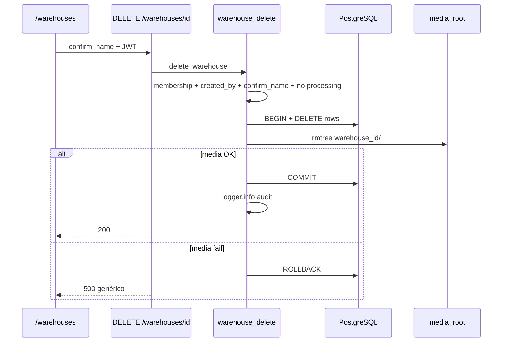

# Implementation Plan: Eliminar almacén (warehouse)

**Branch**: `001-delete-warehouse` (git) | **Change**: `002-delete-warehouse` (SDD folder) | **Date**: 2026-07-06 | **Spec**: [spec.md](./spec.md)  
**Constitution**: `.specify/memory/constitution.md` v1.0.0

**Input**: Feature specification from `specs/changes/002-delete-warehouse/spec.md`

## Summary

Permitir al **creador** de un almacén eliminarlo permanentemente desde `/warehouses`, con confirmación por nombre exacto, bloqueo si hay lotes en `processing`, borrado transaccional de **todas** las filas relacionadas en BD, eliminación del directorio media del warehouse, y limpieza del estado cliente (selección + cola offline). Auditoría solo en logs del servidor.

Enfoque técnico: actualizar contrato activo → servicio `warehouse_delete.py` → endpoint `DELETE /warehouses/{id}` → diálogo Material en `warehouses.component.ts` → tests de integración.

## Technical Context

**Language/Version**: Python 3.12 (backend), TypeScript / Angular 20 (frontend)

**Primary Dependencies**: FastAPI, SQLAlchemy 2.x, Pydantic, Angular Material, RxJS

**Storage**: PostgreSQL (prod) / SQLite (dev); filesystem `media_root/{warehouse_id}/`

**Testing**: pytest (backend), `npm run build` (frontend)

**Target Platform**: Linux containers (K8s), PWA browser clients

**Project Type**: Web application (backend + frontend)

**Performance Goals**: Eliminación de almacén típico (<500 items, <200 fotos) en <30s (objetivo de diseño, verificado en smoke manual — no gate automatizado); SC-001 flujo UI <2 min

**Constraints**: Operación atómica BD+media (FR-008); solo online; sin migración de esquema en v1; UI en español

**Scale/Scope**: 1 endpoint, 1 servicio backend, 1 pantalla UI, 6+ tests integración, 1 actualización de contrato

## Constitution Check

*GATE: Must pass before implementation. Re-check after contract draft (pre-code) and before merge.*

Reference: `.specify/memory/constitution.md` v1.0.0

| Principle | Status | Evidence in this plan |
|-----------|--------|------------------------|
| **I.** Code / contracts | PASS | Nuevo comportamiento se documentará en `specs/contracts/app/contract.md` antes de código; no se usa `specs.md` raíz |
| **II.** Manifest-driven | PASS | Change activo `002-delete-warehouse` en `specs/manifest.yml`; lectura acotada a este change + contrato `app` |
| **III.** Contract before impl | PASS | **T0** actualiza contrato activo antes de T1–T5 (implementación) |
| **IV.** Incremental changes | PASS | Artefactos en `specs/changes/002-delete-warehouse/`; cierre → `specs/archive/` + manifest |
| **V.** Tests | PASS | `test_delete_warehouse.py` con 9 casos; validación estrecha antes de suite completa |
| **VI.** Security | PASS | `created_by` + membresía; `confirm_name`; 403/400/409; API `detail` inglés / UI español; sin rutas internas; log sin secretos |
| **VII.** Simplicity | PASS | Un servicio, un endpoint, sin migración Alembic; sin refactors colaterales |

**Pre-implementation gate:** BLOCKED until **T0** (contract update) is complete.  
**Post-design re-check:** PASS (research + change-level contracts done).  
**Pre-merge gate:** contract aligned with code + full pytest + frontend build.

## Implementation Order (constitution-aligned)

Orden obligatorio según principios III, V y workflow de constitución:

```
T0  Contrato activo (specs/contracts/app/contract.md)
 → T1–T3 Backend (servicio + endpoint + tests estrechos)
 → T4–T5 Frontend (service + UI + sync purge)
 → T6 Validación amplia (pytest + build)
 → T7 Cierre SDD (manifest, archive) — post-merge / al completar change
```

No iniciar T1 hasta completar T0.

## Project Structure

### Documentation (this feature)

```text
specs/changes/002-delete-warehouse/
├── spec.md
├── plan.md
├── research.md
├── data-model.md
├── quickstart.md
├── contracts/delete-warehouse-api.md   # contrato incremental del change
├── context-pack.md
└── tasks.md                            # /speckit-tasks
```

**Contrato durable:** `specs/contracts/app/contract.md` (actualizar en T0).

### Source Code

```text
backend/app/services/warehouse_delete.py       # NEW
backend/app/api/v1/endpoints/warehouses.py     # DELETE
backend/app/schemas/warehouse.py               # WarehouseDeleteRequest
backend/tests/test_delete_warehouse.py         # NEW

frontend/src/app/warehouses/warehouses.component.ts
frontend/src/app/services/warehouse.service.ts
frontend/src/app/services/sync.service.ts      # purgeWarehouse()
```

## Phase 0: Research — Completado

[research.md](./research.md) — atomicidad BD+media, orden de borrado, 409 processing, auditoría en logs.

## Phase 1: Design — Completado

- [data-model.md](./data-model.md)
- [contracts/delete-warehouse-api.md](./contracts/delete-warehouse-api.md) (contrato del change; T0 lo consolida en contrato `app`)

### Flujo backend



### Seguridad (Principle VI)

| Control | Implementación |
|---------|----------------|
| Autorización | `require_warehouse_membership` + `warehouse.created_by == current_user.id` |
| Confirmación | Body `confirm_name` exact match |
| Errores usuario | API `detail` en inglés (convención existente); UI/snackbars en español; sin paths de `media_root` ni stack traces |
| Auditoría | `logger.info` con `warehouse_id`, `actor_user_id`; sin API keys |

### Flujo UI

1. `list()` + `me()` → botón eliminar solo si `created_by === me.id` (FR-001b)
2. `MatDialog`: advertencia irreversible + input nombre
3. Éxito → limpiar `mw_selected_warehouse_id`, `purgeWarehouse()`, snackbar en español, refrescar lista
4. Sin red → deshabilitar eliminar con mensaje en español (assumption online-only)
5. Co-miembro en `/app/*` con warehouse borrado → guard valida selección contra `list()`, limpia selección, snackbar en español, redirect a `/warehouses`

## Phase 2: Tasks

Ejecutar `/speckit-tasks` para generar `tasks.md` con este orden.

| ID | Fase | Descripción | Principio |
|----|------|-------------|-----------|
| **T0** | Contrato | Actualizar `specs/contracts/app/contract.md`: DELETE warehouse, permisos creador, bloqueo processing, limpieza media | III |
| T1 | Backend | `warehouse_delete.py` — borrado atómico multi-tabla + media | VII |
| T2 | Backend | Schema `WarehouseDeleteRequest` + `DELETE /warehouses/{id}` | VI |
| T3 | Backend | `test_delete_warehouse.py` (9 casos: 6 originales + rollback media, idempotencia 404, otros warehouses intactos) | V |
| T4 | Frontend | `warehouse.service.delete()` + dialog en `/warehouses` | VI, VII |
| T5 | Frontend | `sync.service.purgeWarehouse()` + limpiar selección + `warehouse.guard` co-miembro | I (estado cliente) |
| T6 | QA | `uv run pytest tests/test_delete_warehouse.py` → `uv run pytest` → `npm run build` | V |
| T7 | SDD cierre | Mover change a archive, actualizar `manifest.yml` status | IV |

## Validation Plan (Principle V)

```bash
# Estrecho (durante T3)
cd backend && uv run pytest tests/test_delete_warehouse.py -q

# Amplio (T6)
cd backend && uv run pytest -q
cd frontend && npm run build
```

Smoke manual: ver [quickstart.md](./quickstart.md).

## Risks & Mitigations

| Riesgo | Mitigación |
|--------|------------|
| Self-FK `boxes` | Borrar hijos antes que padres o DELETE bulk por `warehouse_id` |
| Worker intake tras 409 | Pre-check `intake_batches.status=processing` |
| Media grande / timeout | Log duración; 500 genérico; warehouse intacto (rollback) |
| Contrato desalineado post-impl | T0 antes de código; revisar contrato en T7 |

## Complexity Tracking

Sin violaciones de constitución. No se requiere justificación adicional.

## Change Completion Checklist (Principle IV)

- [ ] Código y tests en branch `001-delete-warehouse`
- [ ] `specs/contracts/app/contract.md` refleja comportamiento implementado
- [ ] Change movido a `specs/archive/002-delete-warehouse/`
- [ ] `specs/manifest.yml` actualizado (`status: completed`)
